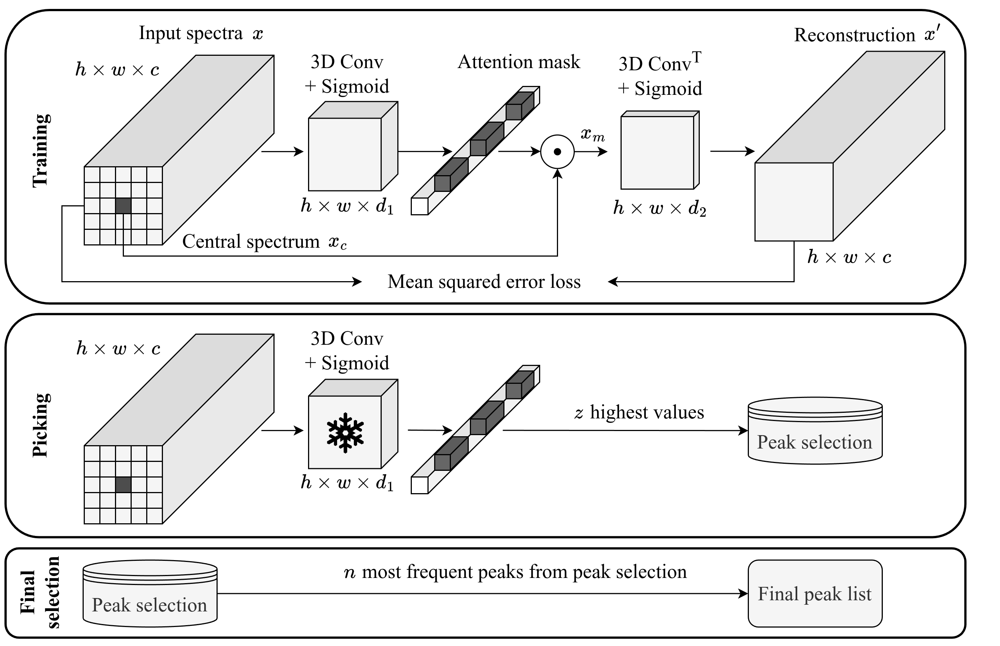

# Spatial self-supervised Peak Learning and correlation-based Evaluation of peak picking in Mass Spectrometry Imaging

S3PL is a spatial self-supervised peak learning autoencoder network which performs spatially structured peak picking on profile mass spectrometry imaging (MSI) data. This repository contains the source code for the corresponding paper:

[Spatial self-supervised Peak Learning and
correlation-based Evaluation of peak picking in Mass
Spectrometry Imaging](https://www.google.com)

[Philipp Weigand](https://scholar.google.com/citations?user=WBCzjgcAAAAJ&hl=de), [Nikolas Ebert](https://scholar.google.de/citations?user=CfFwm1sAAAAJ&hl=de), [Shad A. Mohammed](https://scholar.google.com/citations?user=tVc0nX8AAAAJ&hl=de&oi=ao), [Denis Abu Sammour](https://scholar.google.com/citations?user=RNmOep0AAAAJ&hl=de&oi=ao), [Carsten Hopf](https://scholar.google.com/citations?user=Q8T-d1MAAAAJ&hl=de&oi=ao) & [Oliver Wasenmüller](https://scholar.google.de/citations?user=GkHxKY8AAAAJ&hl=de) \
**[CeMOS - Research and Transfer Center](https://www.cemos.hs-mannheim.de/ "CeMOS - Research and Transfer Center"), [University of Applied Sciences Mannheim](https://www.english.hs-mannheim.de/the-university.html "University of Applied Sciences Mannheim")**

## Demo version
We provide two ways for testing our code with minimal effort:
1. Google colab demo for the Colorectal Adenocarcinoma tissue sections. 

2. Docker image on dockerhub, where the enviroment and the Colorectal Adenocarcinoma dataset are already set up. To execute the script, install [Docker](https://www.docker.com/get-started) and run one of the following commands based on your operating system.

Linux / macOS:

       # Linux / macOS #
       # CPU #
       docker run --rm -v $(pwd)/results:/workspace/results philippweigand/s3pl:latest

       # GPU #
       docker run --gpus all --rm -v $(pwd)/results:/workspace/results philippweigand/s3pl:latest

       # Windows PowerShell #
       # CPU #
       docker run --rm -v ${PWD}/results:/workspace/results philippweigand/s3pl:latest

       # GPU #
       docker run --gpus all --rm -v ${PWD}/results:/workspace/results philippweigand/s3pl:latest

       #Windows cmd.exe#
       # CPU #
       docker run --rm -v %cd%/results:/workspace/results philippweigand/s3pl:latest
       
       # GPU #
       docker --gpus all run --rm -v %cd%/results:/workspace/results philippweigand/s3pl:latest

For reproducibility, we recommend using the docker setup described below.

## Installation
We recommend using [Docker](https://www.docker.com/get-started) for a clean setup. Alternatively, setup a local environment.

### Docker Setup (Recommended)

1. Clone our repository using [git](https://git-scm.com/)

       git clone https://github.com/CeMOS-IS/S3PL.git
       cd S3PL/

2. Build the [Docker](https://www.docker.com/get-started) image by using the following command in the terminal of this projects folder:

       docker build -t s3pl .

3. Run the Docker container:

       docker run -it --rm --gpus '"device=0"' -v .:/workspace s3pl
       
       or

       docker run -it --rm -v /path/to/S3PL:/workspace s3pl (If you are not in the S3PL directory)

Depending on your GPU you might have to change the base image in the first line of the Dockerfile.

### Local Setup 

1. Clone our repository using [git](https://github.com/CeMOS-IS/)

       git clone https://github.com/CeMOS-IS/S3PL.git

2. Setup a virtual environment for example with Anaconda

       conda create --name s3pl python=3.11.5    
       conda activate s3pl

3. Install the required python packages:

       pip install -r requirements.txt

## Data preparation

At first use, create the `data/` folder within the `s3pl/` folder. For every dataset, create a new folder in the `data/` folder. As example data you can use the selected tissue sections from the CAC dataset, which we also use in our paper. It is available [here](https://clousi.hs-mannheim.de/index.php/s/ETC4i3j9QpweAJx)

 The dataset folder should contain the `.imzML` files and the corresponding `.ibd` files. If there are segmentation masks available, create a `masks/` folder and put the corresponding segmentation masks in there (`filename_mask.npy`).
The folder structure should be as follows:

    s3pl
    ├── data
        ├── dataset1
        │   ├── masks
        │   │   ├── file1_mask.npy
        │   │   ├── file2_mask.npy
        │   │   └── ...
        │   ├── file1.imzML
        │   ├── file1.ibd
        │   ├── file2.imzML
        │   ├── file2.ibd
        │   └── ...
        ├── cac
        │   ├── masks
        │   │   ├── 40TopL_mask.npy
        │   │   ├── 40TopL_mask.npy
        │   │   └── ...
        │   ├── 40TopL.imzML
        │   ├── 40TopL.ibd
        │   └── ...
        └── ...

## Application
To use S3PL for peak picking, specify the `.imzML` file as the `data_dir` in the `s3pl/config.json` file.
Then, run the `s3pl/main.py` file:

    python s3pl/main.py

The resulting peak list will be stored in a `.csv` file in the folder

    results/<name_of_the_training>/peak_evaluation_<filename>.txt

Available configurations in config.json:

- `data_dir`: relative path to .imzML file,
- `number_classes`: the number of classes in the segmentation mask (e.g. 3 classes: background, tumor, healthy tissue),
- `evaluate_peak_picking`: whether peak picking should be evaluated using our correlation-based procedure (segmentation masks are required for this),

Parameters in config.json:
- `number_peaks` $n$: the number of total peaks to be picked,
- `peaks_per_spectral_patch` $z$: the number of peaks per spectral patch,
- `spectral_patch_size` $p$: size of the spectral patch $p$ = $h$ = $w$,
- `kernel_depth_d1` $d_1$: depth $d_1$ of the 3D convolution,
- `kernel_depth_d2` $d_2$: depth $d_2$ of the 3D transposed convolution

The number of total peaks $n$ to be picked can be specified by the parameter `number_peaks` in the `s3pl/config.json` file. In order to use different numbers of peaks $n$ for different filenames, specify them in the `s3pl/data_configs.py` file and assign `null` to the `number_peaks` parameter. The same applies for the number of classes using the `number_classes` parameter.

## Contact

Email: p.weigand@doktoranden.th-mannheim.de

## Citing S3PL
If you use this code in your research, please cite our paper:

    @article{,
    title={},
    author={},
    journal={},
    volume={},
    number={},
    pages={},
    year={},
    publisher={}
    }

